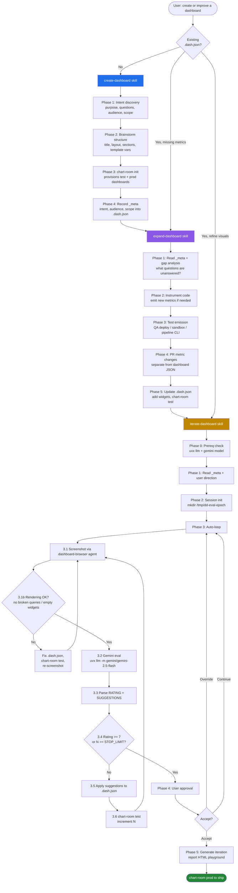

# Datadog Dashboards Plugin

Collaborative Datadog dashboard creation with best-practice widget selection, metric instrumentation, and Gemini-driven visual iteration.

## Installation

Install via the Claude Code CLI by pointing at this marketplace:

```sh
claude --plugin-url https://github.com/brady-zip/local-marketplace
```

Then enable the plugin from the marketplace prompt, or install it directly:

```sh
claude plugin install datadog-dashboards@local-marketplace
```

After install, verify all dependencies are present:

```sh
${CLAUDE_PLUGIN_ROOT}/scripts/check-setup.sh
```

The check script verifies:

- `chart-room` CLI (used by all three skills for dashboard sync)
- `DD_API_KEY` / `DD_APP_KEY` environment variables (metric search)
- `uvx` + `llm` + a Gemini model (`gemini/gemini-2.5-flash` preferred — used by iterate-dashboard)
- `mise` + Chrome Beta (the bundled `datadog-dashboard-viewer` MCP launches via `mise x node@22 -- npx -y chrome-devtools-mcp@latest --autoConnect --channel=beta`)
- `jq`, `curl`, `base64` shell helpers
- SOCKS proxy / `httpx[socks]` compatibility (common gotcha behind corporate proxies)

If any required check fails, the script prints the exact remediation command.

## Workflow

The plugin is structured as three handoff skills, each with a focused responsibility. You typically enter at `create-dashboard` and let it hand off down the chain, but you can also start at `expand-dashboard` or `iterate-dashboard` for an existing `.dash.json` file.



### Skills

| Skill | When to use | Output |
|-------|-------------|--------|
| `create-dashboard` | Starting from scratch | `.dash.json` with `_meta` + section skeleton |
| `expand-dashboard` | Existing dashboard missing metrics or sections | New widgets backed by instrumented metrics |
| `iterate-dashboard` | Existing dashboard needs visual refinement | Polished `.dash.json` rated 7+/10 by Gemini |

### Agent

`dashboard-browser` — drives Chrome via the bundled `datadog-dashboard-viewer` MCP server (a `chrome-devtools-mcp` instance launched with `--autoConnect`) to screenshot dashboards for the iterate-dashboard auto-loop. Don't call MCP tools directly; always go through this agent so navigation timing and viewport sizing are handled.

### MCP server

The plugin ships a `.mcp.json` that registers a `datadog-dashboard-viewer` server:

```jsonc
{
  "datadog-dashboard-viewer": {
    "command": "mise",
    "args": ["x", "node@22", "--", "npx", "-y", "chrome-devtools-mcp@latest", "--autoConnect", "--channel=beta"]
  }
}
```

`--autoConnect` attaches to a Chrome instance you already have running rather than spawning a fresh one — keep your authenticated Datadog session open in **Chrome Beta** before invoking iterate-dashboard. `--channel=beta` pins to the Beta channel so debug-pipe permissions don't conflict with your day-to-day stable Chrome.

### Knowledge

- `knowledge/widget-selection-guide.md` — decision matrix for picking widget types
- `knowledge/dashboard-json-reference.md` — JSON schema reference for `template_variables`, `layout_type`, widget structure

## Output

Each skill produces a `.dash.json` file (note: `.dash.json`, not `.dashboard.json`) that:

- Tracks dashboard intent and audience as `_meta` fields
- Is uploaded to a `[TEST]` Datadog dashboard via `chart-room test <file>`
- Is shipped to prod via `chart-room prod <file>` once approved
- Lives in source control alongside the services it observes

## Key Principles

- **Intent first** — every dashboard answers 3-5 specific questions for a specific audience, recorded in `_meta.intent` / `_meta.audience`
- **Metrics before widgets** — never add a widget that references a metric that doesn't yet exist; expand-dashboard enforces this
- **Template variables are mandatory** — at minimum `env` and `service`
- **Query Values get conditional formatting** — thresholds drive the color
- **Timeseries get markers** — SLO thresholds and incident lines
- **Sections use Group widgets** — with Note headers for context
- **Gemini is the evaluator** — iterate-dashboard does not self-evaluate; it always defers to Gemini's rating

## Troubleshooting

Run `scripts/check-setup.sh` first. The most common failures:

- **`uvx` not on PATH** — install with `curl -LsSf https://astral.sh/uv/install.sh | sh`
- **No Gemini model** — `uvx llm install llm-gemini && uvx llm keys set gemini`
- **SOCKS proxy + missing `socksio`** — `uv tool install llm --with 'httpx[socks]' --with llm-gemini`
- **`chart-room` missing** — install the chart-room CLI; it's the connective tissue between local `.dash.json` files and Datadog
