# Datadog Dashboards Plugin

Collaborative Datadog dashboard creation with best-practice widget selection, metric instrumentation, and Gemini-driven visual iteration.

## Installation

Add the marketplace once per machine, then install the plugin — either from inside a Claude Code session or from the terminal:

<details>
<summary><strong>In Claude Code</strong> (slash commands)</summary>

```
/plugin marketplace add brady-zip/bradys-marketplace
/plugin install datadog-dashboards@bradys-marketplace
```

</details>

<details>
<summary><strong>From the terminal</strong> (CLI)</summary>

```sh
claude plugin marketplace add brady-zip/bradys-marketplace
claude plugin install datadog-dashboards@bradys-marketplace
```

</details>

You do not have to run a setup step. **Every skill runs `scripts/preflight.sh` as its
Phase 0, on every invocation**, and repairs what it can before doing any work.

It is not an instruction the model has to remember — each SKILL.md carries it as an inline
bash block, which Claude Code executes on invocation and injects into context:

```
!`bash "${CLAUDE_PLUGIN_ROOT}/scripts/preflight.sh" --skill create --brief 2>&1 || true`
```

The previous version *told* Claude to run a check, and that is exactly the kind of
instruction that gets skipped. `--brief` keeps a healthy machine to two lines of output;
`|| true` is there because a non-zero exit from an inline block aborts the whole skill
invocation, which would replace a useful "here's what to install" report with a bare
"shell command failed".

To inspect your machine yourself without changing anything:

> run the datadog-dashboards check-setup script

Both paths share one implementation (`scripts/preflight.sh`); they differ only in posture.

| | `preflight.sh` | `check-setup.sh` |
|---|---|---|
| When | automatically, at the top of every skill invocation | when you ask |
| Scope | just what the skill about to run needs (`--skill create\|expand\|iterate`) | everything, for every skill |
| Missing dependency | installs it if it can, otherwise stops the skill | reports it, never installs |

### What is checked

| Dependency | Auto-repaired? |
|---|---|
| `uv` / `uvx` | yes — astral installer into `~/.local/bin` |
| `llm` + `llm-gemini` + `httpx[socks]` | yes — `uv tool install llm --force --with llm-gemini --with 'httpx[socks]'` |
| `mise`, `node@22` | yes — `mise` installer, then `mise install node@22` |
| `jq` | yes, when Homebrew is present |
| A live Gemini call (`--smoke`) | no — reports a dead or rejected key |
| `DD_API_KEY` / `DD_APP_KEY`, validated against `/api/v1/validate` | no — they're secrets |
| Gemini API key | no — it's a secret |
| `chart-room` CLI | no — internally distributed binary |
| Chrome Beta installed **and running** | no — it's a GUI app with your Datadog session |

Anything not auto-repairable exits non-zero with the exact remediation command, and the
skill stops and shows it to you rather than working around it.

### Why preflight runs every single time

The check it replaces gave a confident wrong answer. It probed:

```sh
uvx llm models | grep -i gemini
```

…and reported "no Gemini model" on a machine that had `llm`, `llm-gemini` and a valid key
installed for three months. `uvx llm` runs an **ephemeral, plugin-less environment**
unless uv finds a persistent `llm` tool to reuse — and whether it does depends on which
`uv` wins the PATH race (on the machine in question, uv resolved inside a mise-managed
Python with its own tool directory). Nothing was broken except the question being asked.

So preflight asks the `llm` on PATH first and treats `uvx llm` as a fallback only, and it
re-asks every run: no cache, no once-per-session stamp, no "the user already ran it". This
plugin is installed by people who don't know its internals, on machines that drift — a
wiped `uv tool` directory, an expired Datadog key, a Chrome Beta that isn't running today,
a different `uv` winning that race. A result from five minutes ago is not evidence about
now. Every check is cheap enough to pay for on each run.

**What preflight does not buy you.** It is about the machine. The run that prompted all of
this was never environment-blocked — it dropped one handoff line and silently deleted two
downstream skills. A green preflight is not evidence that a run was complete. That is what
the completion ledgers are for, and the two are not interchangeable.

The corollary rule, in `knowledge/preflight-contract.md`: **never substitute judgement
for a missing dependency.** If Gemini is unreachable, `iterate-dashboard` stops — it does
not quietly become a skill where Claude rates its own dashboard. A degraded run that looks
successful is worse than one that stops, because you can't tell the difference.

### Completion ledgers

Every skill ends by printing a table of its own phases with `DONE` / `SKIPPED` / `FAILED`
and a reason for anything that isn't `DONE`.

This is the half of the fix that actually addresses what went wrong. `create-dashboard`
completed Phases 1–4 and then never invoked `expand-dashboard` — no error, it simply had
the queries in hand and continuing inline felt like finishing work in progress. Expand
never ran, so `iterate-dashboard` never ran, so there was no Gemini evaluation and no
iteration report. **One skipped line silently removed two entire skills from the run.**

`create-dashboard`'s Phase 5 now names that rationalization explicitly and forbids
authoring widget content in that skill at all, and its ledger requires spelling out the
cascade whenever the handoff didn't happen. Skipping a phase is allowed — a user can want
to stop early. Skipping it silently is not.

### Known Datadog landmines

`knowledge/rum-widget-landmines.md` collects RUM constructs that upload cleanly and then
fail at render, several of them silently — `timeshift()` on a RUM query produces an empty
widget with no error at all. Also: Datadog chart canvases paint lazily, so a blank
screenshot is **not** evidence of broken widgets. Widget health is read from
`document.body.innerText`, never from pixels.

## Workflow

The plugin is structured as three handoff skills, each with a focused responsibility. You typically enter at `create-dashboard` and let it hand off down the chain, but you can also start at `expand-dashboard` or `iterate-dashboard` for an existing `.dash.json` file.

```mermaid
flowchart TD
    Start([User: create or improve a dashboard]) --> CreateOrEnter{Existing<br/>.dash.json?}

    CreateOrEnter -- No --> Create[create-dashboard skill]
    Create --> C0[Phase 0: Preflight + self-repair<br/>scripts/preflight.sh --skill create]
    C0 --> C1[Phase 1: Intent discovery<br/>purpose, questions, audience, scope]
    C1 --> C2[Phase 2: Brainstorm structure<br/>title, layout, sections, template vars]
    C2 --> C3[Phase 3: chart-room init<br/>provisions test + prod dashboards]
    C3 --> C4[Phase 4: Record _meta<br/>intent, audience, scope into .dash.json]
    C4 --> Expand

    CreateOrEnter -- Yes, missing metrics --> Expand[expand-dashboard skill]
    Expand --> E0[Phase 0: Preflight + self-repair<br/>--skill expand, validates DD keys live]
    E0 --> E1[Phase 1: Read _meta + gap analysis<br/>what questions are unanswered?]
    E1 --> E2[Phase 2: Instrument code<br/>emit new metrics if needed]
    E2 --> E3[Phase 3: Test emission<br/>QA deploy / sandbox / pipeline CLI]
    E3 --> E4[Phase 4: PR metric changes<br/>separate from dashboard JSON]
    E4 --> E5[Phase 5: Update .dash.json<br/>add widgets, chart-room test]
    E5 --> Iterate

    CreateOrEnter -- Yes, refine visuals --> Iterate[iterate-dashboard skill]
    Iterate --> I0[Phase 0: Preflight + self-repair<br/>--skill iterate, live Gemini call]
    I0 --> I1[Phase 1: Read _meta + user direction]
    I1 --> I2[Phase 2: Session init<br/>mkdir /tmp/dd-eval-epoch]
    I2 --> Loop

    Loop[Phase 3: Auto-loop] --> L1[3.1 Screenshot via dashboard-browser agent]
    L1 --> L1b{3.1b Rendering OK?<br/>no broken queries / empty widgets}
    L1b -- No --> Lfix[Fix .dash.json,<br/>chart-room test,<br/>re-screenshot]
    Lfix --> L1
    L1b -- Yes --> L2[3.2 Gemini eval<br/>llm -m gemini/gemini-2.5-flash]
    L2 --> L3[3.3 Parse RATING + SUGGESTIONS]
    L3 --> L4{3.4 Rating >= 7<br/>or N >= STOP_LIMIT?}
    L4 -- No --> L5[3.5 Apply suggestions to .dash.json]
    L5 --> L6[3.6 chart-room test<br/>increment N]
    L6 --> L1
    L4 -- Yes --> Approve

    Approve[Phase 4: User approval] --> Decision{Accept?}
    Decision -- Override --> Loop
    Decision -- Continue --> Loop
    Decision -- Accept --> Report[Phase 5: Generate iteration<br/>report HTML playground]
    Report --> Ledger[Phase 6: Completion ledger<br/>every phase DONE / SKIPPED / FAILED]
    Ledger --> Done([chart-room prod to ship])

    style Create fill:#1f6feb,color:#fff
    style Expand fill:#8957e5,color:#fff
    style Iterate fill:#bf8700,color:#fff
    style Done fill:#238636,color:#fff
```



### Skills

| Skill | When to use | Output |
|-------|-------------|--------|
| `create-dashboard` | Starting from scratch | `.dash.json` with `_meta` + section skeleton |
| `expand-dashboard` | Existing dashboard missing metrics or sections | New widgets backed by instrumented metrics |
| `iterate-dashboard` | Existing dashboard needs visual refinement | Polished `.dash.json` rated 7+/10 by Gemini |

### Agent

`dashboard-browser` — drives Chrome via the bundled `datadog-dashboard-viewer` MCP server (a `chrome-devtools-mcp` instance launched with `--autoConnect`) to screenshot dashboards for the iterate-dashboard auto-loop. Don't call MCP tools directly; always go through this agent so navigation timing and viewport sizing are handled.

### MCP server

The plugin ships a `.mcp.json` that registers a `datadog-dashboard-viewer` server:

```jsonc
{
  "datadog-dashboard-viewer": {
    "command": "mise",
    "args": ["x", "node@22", "--", "npx", "-y", "chrome-devtools-mcp@latest", "--autoConnect", "--channel=beta"]
  }
}
```

`--autoConnect` attaches to a Chrome instance you already have running rather than spawning a fresh one — keep your authenticated Datadog session open in **Chrome Beta** before invoking iterate-dashboard. `--channel=beta` pins to the Beta channel so debug-pipe permissions don't conflict with your day-to-day stable Chrome.

### Knowledge

- `knowledge/widget-selection-guide.md` — decision matrix for picking widget types
- `knowledge/dashboard-json-reference.md` — JSON schema reference for `template_variables`, `layout_type`, widget structure

## Output

Each skill produces a `.dash.json` file (note: `.dash.json`, not `.dashboard.json`) that:

- Tracks dashboard intent and audience as `_meta` fields
- Is uploaded to a `[TEST]` Datadog dashboard via `chart-room test <file>`
- Is shipped to prod via `chart-room prod <file>` once approved
- Lives in source control alongside the services it observes

## Key Principles

- **Intent first** — every dashboard answers 3-5 specific questions for a specific audience, recorded in `_meta.intent` / `_meta.audience`
- **Metrics before widgets** — never add a widget that references a metric that doesn't yet exist; expand-dashboard enforces this
- **Template variables are mandatory** — at minimum `env` and `service`
- **Query Values get conditional formatting** — thresholds drive the color
- **Timeseries get markers** — SLO thresholds and incident lines
- **Sections use Group widgets** — with Note headers for context
- **Gemini is the evaluator** — iterate-dashboard does not self-evaluate; it always defers to Gemini's rating, and stops rather than substituting its own if Gemini is unreachable
- **Preflight every run, repair what you can** — the machine is assumed to have changed since last time
- **Nothing is skipped silently** — every skill prints a completion ledger naming any phase it skipped or failed, and why

## Troubleshooting

Run `bash scripts/check-setup.sh` first — it reports every dependency without touching
your machine. Add `--repair` to let it fix what it can, or just invoke any skill, whose
Phase 0 repairs automatically.

The failures it cannot fix for you:

- **No Gemini API key** — `llm keys set gemini` (get one at https://aistudio.google.com/apikey)
- **`DD_API_KEY` / `DD_APP_KEY` unset or rejected** — export them from Datadog → Organization Settings. Preflight validates them with a live call, so a *rejected* key is reported differently from an *unset* one; a revoked key that's still exported otherwise produces empty metric searches that read exactly like "this metric does not exist".
- **`chart-room` missing** — install the chart-room CLI; it's the connective tissue between local `.dash.json` files and Datadog, and there's no public installer to call.
- **Chrome Beta not installed, or installed but not running** — the MCP uses `--autoConnect`, so it attaches to a browser you already have open with your Datadog session. It will not start one for you.

### `uvx llm` vs `llm`

The plugin now calls `llm` directly and treats `uvx llm` only as a fallback. `uvx llm`
reuses an already-installed `llm` uv tool when one exists and silently falls back to a
bare, plugin-less environment when one doesn't — and in a bare environment `gemini/*`
models do not exist at all. That made "is Gemini configured?" really mean "was `llm` ever
installed as a persistent tool *with* the plugin?", which is why the original failure was
so hard to see. Preflight's repair installs it persistently, with the plugin and the
socks extra, so the question stops being ambiguous.

To opt out of automatic repair entirely, set `DD_DASH_PREFLIGHT_AUTOFIX=0` — preflight
still runs and still reports, it just won't install anything.
